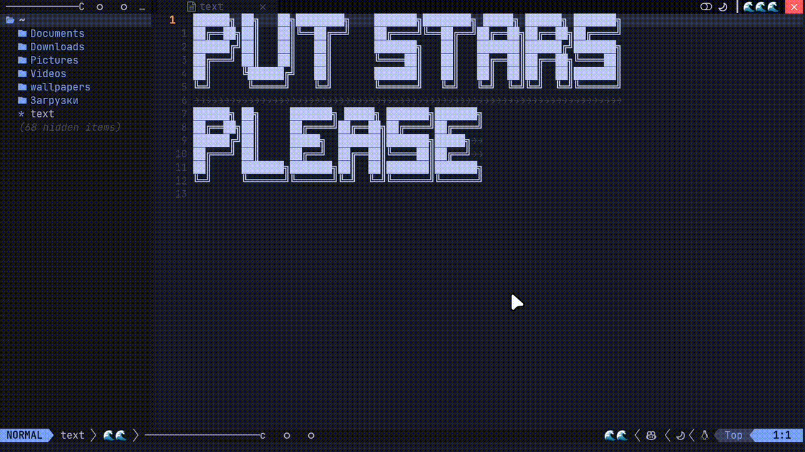

# Pacman Animations for Neovim (`pacman-anims-nvim`)

Pacman Animations Plugin for Neovim adds a Pacman animation, inspired by the Arch Linux `ILoveCandy` boot parameter. This animation fills empty spaces in your interface with a fun and dynamic visual.

 <!-- Replace with your gif link -->

---

## Why use this plugin?

This plugin allows you to:

- Fill empty areas in your interface with a Pacman animation.
- Add a playful touch reminiscent of Arch Linux's `ILoveCandy` setting.

### Requirements

To work correctly, this plugin requires a font with **Nerd Fonts** support (or any font with icon compatibility).

---

## Installation

Install the plugin using your preferred plugin manager.

### Using `lazy.nvim`

```lua
{
    "maarutan/pacman-anims-nvim",
    config = function()
      require("pacman").setup({
          width = 40,
          delay = 300,
          pacman_open = "C",
          pacman_closed = "c",
          path_food = "",
          path_empty = " ",
          path_trail = "─",
  })    end
}
```

### Using `packer.nvim`

```lua
use {
    "maarutan/pacman-anims-nvim",
    config = function()
      require("pacman").setup({
          width = 40,
          delay = 300,
          pacman_open = "C",
          pacman_closed = "c",
          path_food = "",
          path_empty = " ",
          path_trail = "─",
  })    end
}
```

---

## Usage Examples

### Bufferline

Use Pacman animation to fill text in your Bufferline. Add the following configuration:

```lua
require("bufferline").setup({
    offsets = {
        {
            filetype = "neo-tree",
            text = function()
                return require("pacman").get_pacman_text()
            end,
            text_align = "center",
            separator = true,
        },
    },
})
```

 <!-- Replace with your gif link -->

---

### LuaLine

Add the Pacman animation to the center of your LuaLine:

```lua
require("lualine").setup({
    lualine_c = {
        function()
            return require("pacman").get_pacman_text()
        end,
        "fileformat",
        "filetype",
    },
})
```

 <!-- Replace with your gif link -->

---

## Configuration

The plugin provides a `setup()` function to configure various aspects of the Pacman animation, including width, speed, and custom symbols for Pacman and the path.

| Option          | Default Value | Description                                   |
| --------------- | ------------- | --------------------------------------------- |
| `width`         | `30`          | Width of the Pacman path                      |
| `delay`         | `600`         | Animation speed (in milliseconds)             |
| `pacman_open`   | `"C"`         | Symbol for Pacman when the mouth is open      |
| `pacman_closed` | `"c"`         | Symbol for Pacman when the mouth is closed    |
| `path_food`     | `""`         | Symbol representing food for Pacman           |
| `path_empty`    | `" "`         | Symbol representing an empty part of the path |
| `path_trail`    | `"─"`         | Symbol representing the trail left by Pacman  |

### Example Configuration

```lua
require("pacman").setup({
    width = 50,          -- Wider path for more fun
    delay = 400,         -- Faster animation
    pacman_open = "ᗧ",   -- Custom Pacman symbol (open mouth)
    pacman_closed = "ᗤ", -- Custom Pacman symbol (closed mouth)
    path_food = "🍒",    -- Custom food symbol
    path_empty = " ",    -- Keep the path empty as a space
    path_trail = "-",    -- Custom trail symbol
})

```

---

## FAQ

### Why is the animation not showing?

Ensure you are using a font with icon support, such as **Nerd Fonts**.

### How do I enable the tabline?

Add the following line to your configuration:

```lua
vim.o.showtabline = 2
```

---

## Contributing

Ideas, bug reports, and feature requests are welcome! Feel free to open an issue or submit a pull request.

---

## License

This plugin is distributed under the MIT License. See the [LICENSE](LICENSE) file for details.
